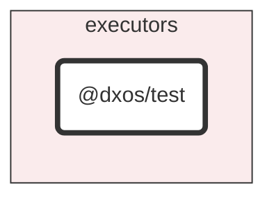

# @dxos/test

## Dependency Graph

```mermaid
%%{ init: {'flowchart':{'curve':'basis'}} }%%

flowchart LR

%% Classes
classDef def fill:#fff,stroke:#333,stroke-width:1px
classDef root fill:#fff,stroke:#333,stroke-width:4px

%% Nodes

subgraph executors [executors]
  style executors fill:#faebec,stroke:#333
  dxos/test("@dxos/test"):::root
  click dxos/test "dxos/dxos/tree/main/tools/executors/test/docs"
end

%% Links
linkStyle default stroke:#333,stroke-width:1px
```

## Dependencies

| Module | Direct |
|---|---|
