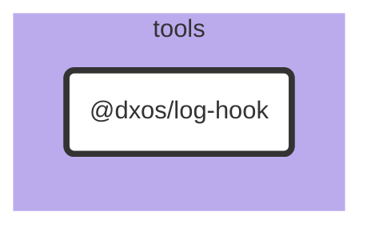

# @dxos/log-hook

Logger

## Dependency Graph

```mermaid
%%{ init: {'flowchart':{'curve':'basis'}} }%%

flowchart LR

%% Classes
classDef def fill:#fff,stroke:#333,stroke-width:1px
classDef root fill:#fff,stroke:#333,stroke-width:4px

%% Nodes

subgraph tools [tools]
  style tools fill:#bbabed,stroke:#fff
  dxos/log-hook("@dxos/log-hook"):::root
  click dxos/log-hook "dxos/dxos/tree/main/tools/log-hook/docs"
end

%% Links
linkStyle default stroke:#333,stroke-width:1px
```

## Dependencies

| Module | Direct |
|---|---|
