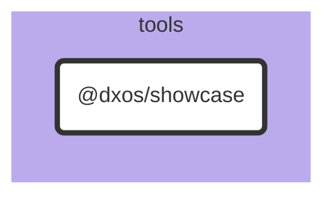

# @dxos/showcase

Components that display other components and references to APIs.

## Dependency Graph

```mermaid
%%{ init: {'flowchart':{'curve':'basis'}} }%%

flowchart LR

%% Classes
classDef default fill:#fff,stroke:#333,stroke-width:1px
classDef root fill:#fff,stroke:#333,stroke-width:4px

%% Nodes

subgraph tools [tools]
  style tools fill:#bbabed,stroke:#fff
  dxos/showcase("@dxos/showcase"):::root
  click dxos/showcase "dxos/dxos/tree/main/tools/showcase/docs"
end

%% Links
linkStyle default stroke:#333,stroke-width:1px
```

## Dependencies

| Module | Direct |
|---|---|
