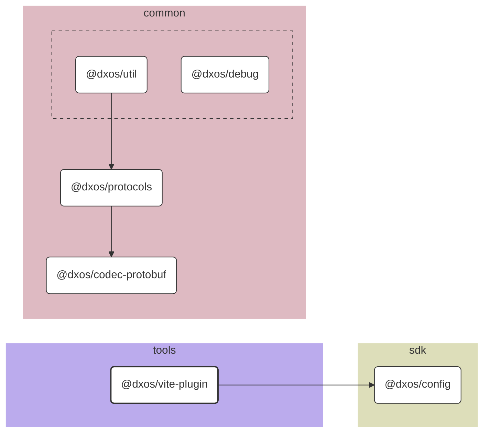

# @dxos/vite-plugin

Plugin to enable Vite to build DXOS apps.

## Dependency Graph

## Dependencies

| Module | Direct |
|---|---|
| [`@dxos/codec-protobuf`](../../../packages/common/codec-protobuf/docs/README.md) |  |
| [`@dxos/config`](../../../packages/sdk/config/docs/README.md) | &check; |
| [`@dxos/debug`](../../../packages/common/debug/docs/README.md) |  |
| [`@dxos/protocols`](../../../packages/common/protocols/docs/README.md) |  |
| [`@dxos/util`](../../../packages/common/util/docs/README.md) |  |
